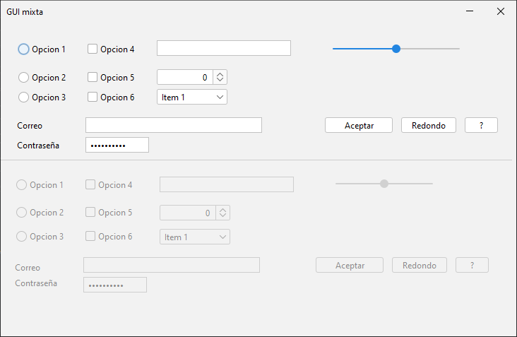

[](https://classroom.github.com/a/1Afva0wJ)
# Práctica 2.4 – Elementos interfaz mixta

El objetivo de esta práctica es profundizar en el manejo de los componentes clásicos de Swing y en la gestión de eventos para construir una interfaz gráfica interactiva y simétrica, aplicando además el uso de la librería FlatLaf para personalizar la apariencia visual.

Crea un proyecto llamado *practica2-4* en la carpeta SOL de github. Puedes utilizar *branches* para delimitar los cambios que vayas haciendo.

## Parte 1

Crear una interfaz mixta utilizando *FlatLaf* con los elementos indicados y con ellos duplicados en espejo, en la que los cambios en la primera parte de la interfaz, sea una imagen para la otra mitad de forma inmediata, excepto al primer campo de texto, que deberá mostrar el duplicado con el texto en *orden inverso*.

Para ello habrá que hacer uso de los **eventos** relacionados con cada componente, para duplicarlos en su correspondiente elemento. 

Se hará uso de los siguientes **controles clásicos** de una interfaz:

-   *2 Campos de texto (JTextField)*
-   *1 Campo de Password (JPasswordField)*
-   *3 Botones (JButtons)*
-   *3 Radio buttons (JRadiobutton)*
-   *3 Casillas verificación (JCheckbox)*
-   *1 Listado (JCombobox)*
-   *1 Barra deslizadora (JSlider)*
-   *1 JSpinner*




## Parte 2

Mejora el ejercicio anterior agregando lo siguiente:
- Agrega un menú superior con las opciones *Archivo* y *Edición* y una **barra de estado inferior** haciendo uso de un *JPane*.
    - El menú Edición deberá tener una entrada para 'borrar todo' que resetea el contenido.
- Agrega un *1 JSplitPane* con dos colores que se duplique y muestra tambíen el porcentaje de la *JSlider* al moverse.   
- Agrega una **validación** en tiempo real del campo de texto del **correo** en el que verifique que esté correctamente formado. 
    - Mientras la validación del correo no sea correcta deberá de mostrar el cuadro de texto con un **borde en color rojo**.
    - Al validarse correctamente, deberá mostrar un **JCheckbox** marcado y un mensaje en la **barra de estado** inferior.
- Modifica las propiedades de los botones Redondo, ayuda, y las propiedades del JPassWordField utilizando propiedades de **Flatlaf**:
    - El campo contraseña deberá tener un botón integrado para mostrar su contraseña.
    - El botón redondo deberá de tener forma redonda.
    - El botón ayuda deberá mostrar un icono de ayuda.

```java
// para hacer un botón redondo o mostrar un botón de ayuda de entre distintas propiedades de Flatlaf
boton.putClientProperty(FlatClientProperties.BUTTON_TYPE, FlatClientProperties.BUTTON_TYPE_ROUND_RECT); 
boton.putClientProperty(FlatClientProperties.BUTTON_TYPE, FlatClientProperties.BUTTON_TYPE_HELP);
````


## Pruebas (testing) 

| ID Caso Prueba | Descripción Caso de Prueba                       | Entrada / Acción                                       | Salida Esperada                                                                                 | Resultado    |
| -------------- | ------------------------------------------------ | ------------------------------------------------------ | ----------------------------------------------------------------------------------------------- | ------------ |
| 01             | Verificar campos de texto (`JTextField`)         | Escribir texto en el primer campo                      | Se duplica en la otra mitad en orden inverso                                                    | OK |
| 02             | Verificar campos de texto (`JTextField`)         | Escribir texto en el segundo campo                     | Se duplica igual en la otra mitad                                                               | No cumple |
| 03             | Verificar campo contraseña (`JPasswordField`)    | Escribir una contraseña                                | Se duplica en la otra mitad (oculta). Permite mostrar u ocultar el texto con el botón integrado | No cumple |
| 04             | Verificar botones (`JButton`)                    | Pulsar los botones                                     | Su acción se refleja en el botón duplicado                                                      | OK |
| 05             | Verificar botón redondo (`FlatLaf`)              | Observar el botón redondo                              | Tiene forma redonda según la propiedad FlatLaf                                                  | OK |
| 06             | Verificar botón de ayuda (`FlatLaf`)             | Pulsar el botón ayuda                                  | Muestra un icono de ayuda y/o mensaje emergente                                                 | No cumple |
| 07             | Verificar Radio Buttons (`JRadioButton`)         | Cambiar la selección de un grupo de radio buttons      | Se duplica en la otra mitad y se respeta la exclusividad de grupo                               | OK |
| 08             | Verificar Casillas de verificación (`JCheckBox`) | Marcar y desmarcar una casilla                         | Se duplica el estado en la otra mitad                                                           | OK |
| 09             | Verificar Listado (`JComboBox`)                  | Cambiar el valor seleccionado                          | Se actualiza en la otra mitad                                                                   | OK |
| 10             | Verificar Spinner (`JSpinner`)                   | Cambiar el valor                                       | Se duplica el valor en la otra mitad                                                            | OK |
| 11             | Verificar Barra deslizadora (`JSlider`)          | Deslizar la barra                                      | Se duplica en la otra mitad y se muestra el porcentaje                                          | OK |
| 12             | Verificar `JSplitPane`                           | Cambiar el tamaño de las divisiones                    | Se refleja el color o posición en ambas mitades                                                 | No cumple |
| 13             | Verificar Menú “Archivo”                         | Desplegar el menú                                      | Se muestran las opciones correspondientes                                                       | OK |
| 14             | Verificar Menú “Edición → Borrar todo”           | Seleccionar “Borrar todo”                              | Todos los campos y selecciones se restablecen                                                   | OK |
| 15             | Verificar Barra de estado (`JPanel` inferior)    | Realizar distintas acciones                            | Muestra mensajes contextuales (validación, acciones, etc.)                                      | OK |
| 16             | Validación campo correo (incorrecto)             | Escribir correo sin formato válido                     | Se muestra borde rojo                                                                           | OK |
| 17             | Validación campo correo (correcto)               | Escribir correo con formato correcto (con @ y dominio) | Borde normal, se marca checkbox verde y muestra mensaje en barra de estado                      | OK |

